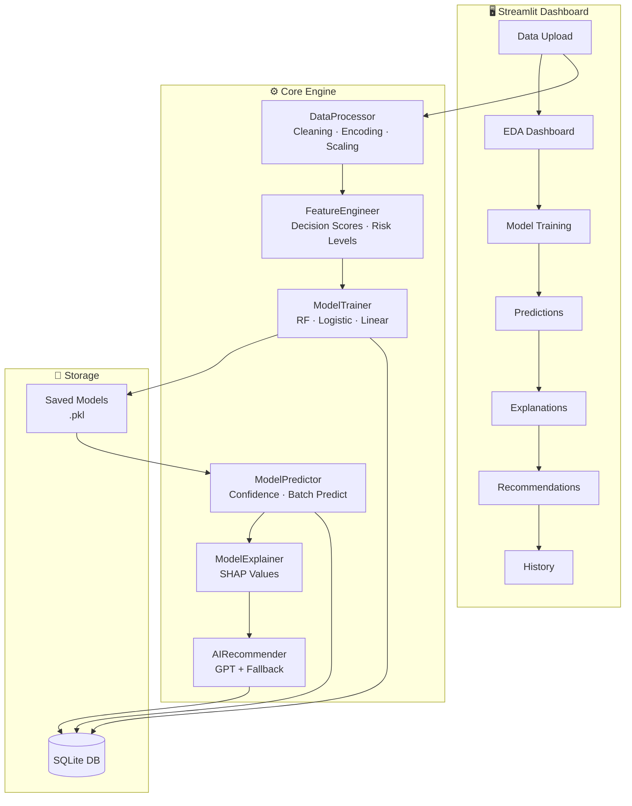
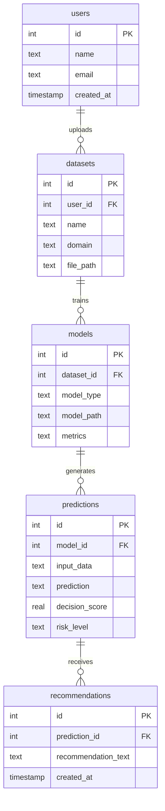

<div align="center">

# 🧠 AI-Powered Personal Decision Intelligence System

### _Transform raw data into intelligent, explainable decisions with the power of Machine Learning & AI_

[](https://python.org)
[](https://streamlit.io)
[](https://scikit-learn.org)
[](https://shap.readthedocs.io)
[](https://openai.com)
[](#license)

---

An end-to-end ML-powered decision intelligence platform that analyzes your data, trains predictive models, explains outcomes with SHAP, and delivers actionable AI recommendations — all through a sleek, interactive dashboard.

[🚀 Quick Start](#-quick-start) · [✨ Features](#-features) · [📸 Screenshots](#-screenshots) · [�️ Architecture](#%EF%B8%8F-architecture) · [📖 Usage Guide](#-usage-guide)

</div>

---

<div align="center">

> ## �🌐 **[✨ Try the Live Demo ✨](https://ai-personal-decision-intelligence-system-p3vjhnd9vappnyyteqv3t.streamlit.app/)**
>
> **🚀 No installation needed — click above to explore the app instantly!**
>
> [](https://ai-personal-decision-intelligence-system-p3vjhnd9vappnyyteqv3t.streamlit.app/)

</div>

---

## ✨ Features

<table>
<tr>
<td width="50%">

### 📤 Smart Data Ingestion
- Upload CSV files or enter data manually
- Auto-detect column types (numerical/categorical)
- Handle missing values with multiple strategies
- Outlier detection using IQR method

</td>
<td width="50%">

### 📊 Interactive EDA Dashboard
- Correlation matrix heatmaps
- Distribution histograms & box plots
- Target variable analysis
- Statistical summaries at a glance

</td>
</tr>
<tr>
<td width="50%">

### 🤖 AutoML Model Training
- Auto task detection (classification vs regression)
- Random Forest, Logistic Regression, Linear Regression
- Configurable test split, scaling, and imputation
- Feature importance visualization

</td>
<td width="50%">

### 🔮 Prediction Engine
- Single or batch predictions via manual entry or CSV
- Decision scores quantified on a 0–1 scale
- Risk level classification: 🟢 Low · 🟡 Medium · 🔴 High
- Scatter plot visualization of prediction results

</td>
</tr>
<tr>
<td width="50%">

### 🔬 Explainable AI (XAI)
- SHAP-based local & global explanations
- Feature contribution waterfall charts
- Human-readable explanation text
- Understand _why_ the model made each prediction

</td>
<td width="50%">

### 💡 AI-Powered Recommendations
- GPT-3.5/GPT-4 powered actionable advice
- Domain-aware: Finance · Career · Health · Lifestyle
- Intelligent fallback when API is unavailable
- Context-aware using feature contributions

</td>
</tr>
<tr>
<td colspan="2" align="center">

### 📜 History & Persistence
SQLite-backed tracking of all predictions, recommendations, and trained models with full audit trail

</td>
</tr>
</table>

---

## 🏗️ Architecture



---

## 🛠️ Tech Stack

| Layer | Technology | Purpose |
|-------|-----------|---------|
| **Frontend** | Streamlit | Interactive web dashboard with custom dark theme |
| **ML Engine** | Scikit-learn | Model training, preprocessing, evaluation |
| **Explainability** | SHAP | Local & global model interpretability |
| **AI Layer** | OpenAI GPT-3.5/4 | Natural language recommendations |
| **Visualization** | Plotly, Matplotlib, Seaborn | Interactive charts & statistical plots |
| **Database** | SQLite | Persistent storage for predictions & history |
| **Data Processing** | Pandas, NumPy | Data manipulation & numerical computing |
| **Config** | python-dotenv | Environment variable management |

---

## 📁 Project Structure

```
AI-Personal-Decision-Intelligence-System/
│
├── 📂 app/
│   ├── app.py                    # Streamlit dashboard (main entry point)
│   └── assets/
│       └── bg.jpg                # Custom background image
│
├── 📂 src/
│   ├── data_processing.py        # Data loading, cleaning & preprocessing pipeline
│   ├── feature_engineering.py    # Decision scores, risk indicators, polynomials
│   ├── model_training.py         # Model training & evaluation (classification/regression)
│   ├── model_prediction.py       # Prediction engine with confidence scoring
│   ├── explainability.py         # SHAP-powered model explanations
│   ├── ai_recommendation.py      # LLM-powered recommendation generator
│   ├── eda.py                    # Comprehensive EDA analyzer with Plotly
│   ├── eda_utils.py              # EDA utility functions for the dashboard
│   ├── database_manager.py       # SQLite database operations
│   ├── database_init.py          # Database schema initialization
│   └── verify_database.py        # Database verification utility
│
├── 📂 data/
│   ├── raw/                      # Raw input datasets
│   │   └── user_data.csv         # Sample investment dataset
│   └── processed/                # Cleaned & preprocessed data
│
├── 📂 models/
│   └── decision_model.pkl        # Serialized trained model
│
├── 📂 database/
│   └── user_decisions.db         # SQLite database
│
├── 📂 notebooks/
│   ├── 01_eda.ipynb              # Exploratory Data Analysis notebook
│   └── 02_model_experiments.ipynb # Model experimentation notebook
│
├── .env.example                  # Environment variable template
├── .gitignore                    # Git ignore rules
├── requirements.txt              # Python dependencies
├── QUICKSTART.md                 # Quick start guide
└── README.md                     # You are here!
```

---

## 🚀 Quick Start

### Prerequisites

- **Python 3.8+** installed on your system
- **pip** package manager
- _(Optional)_ OpenAI API key for AI-powered recommendations

### 1️⃣ Clone the Repository

```bash
git clone https://github.com/Subash0123-kish/AI-Personal-Decision-Intelligence-System.git
cd AI-Personal-Decision-Intelligence-System
```

### 2️⃣ Set Up Virtual Environment

```bash
# Create virtual environment
python -m venv venv

# Activate it
# Windows:
venv\Scripts\activate
# macOS/Linux:
source venv/bin/activate
```

### 3️⃣ Install Dependencies

```bash
pip install -r requirements.txt
```

### 4️⃣ Configure Environment _(Optional)_

```bash
# Copy the example env file
cp .env.example .env

# Add your OpenAI API key (for AI recommendations)
# OPENAI_API_KEY=your_api_key_here
```

> **Note:** The system works perfectly without an API key — it automatically falls back to intelligent rule-based recommendations.

### 5️⃣ Launch the Dashboard

```bash
streamlit run app/app.py
```

The dashboard will open at **`http://localhost:8501`** 🎉

---

## 📖 Usage Guide

### Step-by-Step Workflow


| Step | Page | What You Do |
|------|------|-------------|
| **1** | 📤 Data Upload | Upload a CSV file or enter data manually, then select the target column |
| **2** | 📊 EDA Dashboard | View statistics, correlations, distributions, and target analysis |
| **3** | 🤖 Model Training | Choose model type, configure parameters, and train with one click |
| **4** | 🔮 Predictions | Enter new data points or upload a CSV to get predictions with risk levels |
| **5** | 🔍 Explanations | See SHAP-based feature contributions explaining each prediction |
| **6** | 💡 Recommendations | Get AI-generated, domain-specific actionable advice |
| **7** | 📜 History | Review all past predictions and recommendations |

---

## 🎯 Use Cases

<table>
<tr>
<td align="center" width="25%">

### 💰 Finance
Investment analysis<br/>
Risk assessment<br/>
Portfolio optimization

</td>
<td align="center" width="25%">

### 💼 Career
Job success prediction<br/>
Career path analysis<br/>
Skill recommendations

</td>
<td align="center" width="25%">

### 🏥 Health
Health risk scoring<br/>
Treatment predictions<br/>
Lifestyle advice

</td>
<td align="center" width="25%">

### 🎯 Lifestyle
Purchase decisions<br/>
Goal tracking<br/>
Activity recommendations

</td>
</tr>
</table>

---

## ⚙️ Technical Deep Dive

### Decision Score Calculation

| Task Type | Method | Scale |
|-----------|--------|-------|
| **Classification** | Predicted probability | 0.0 – 1.0 |
| **Regression** | Min-Max normalized prediction | 0.0 – 1.0 |

### Risk Level Thresholds

```
🟢 Low Risk:     0.00 – 0.33
🟡 Medium Risk:  0.33 – 0.67
🔴 High Risk:    0.67 – 1.00
```

### Supported Models

| Model | Classification | Regression |
|-------|:-:|:-:|
| Random Forest | ✅ | ✅ |
| Logistic Regression | ✅ | — |
| Linear Regression | — | ✅ |

### Database Schema



---

## 🔧 Sample Data Format

Your CSV should contain feature columns and one target column:

```csv
age,income,savings,debt,credit_score,investment_amount,risk_tolerance,investment_success
25,50000,10000,5000,650,5000,medium,0
30,75000,25000,10000,720,10000,high,1
35,60000,15000,8000,680,7500,medium,0
```

A sample dataset is included at `data/raw/user_data.csv` for quick testing.

---

## 🐛 Troubleshooting

<details>
<summary><strong>Import Errors</strong></summary>

Make sure you're in the project root directory and have installed all dependencies:
```bash
pip install -r requirements.txt
```
</details>

<details>
<summary><strong>SHAP Installation Issues</strong></summary>

If SHAP fails to install, try:
```bash
pip install shap --no-cache-dir
```
</details>

<details>
<summary><strong>OpenAI API Errors</strong></summary>

The system works without an API key. It automatically falls back to intelligent rule-based recommendations. To enable GPT-powered advice, add your key to `.env`.
</details>

<details>
<summary><strong>Database Errors</strong></summary>

The SQLite database is created automatically in the `database/` folder on first run. If issues persist, delete `database/user_decisions.db` and restart the app.
</details>

---

## 🤝 Contributing

Contributions are welcome! This is a beginner-friendly project.

1. **Fork** the repository
2. **Create** a feature branch (`git checkout -b feature/amazing-feature`)
3. **Commit** your changes (`git commit -m 'Add amazing feature'`)
4. **Push** to the branch (`git push origin feature/amazing-feature`)
5. **Open** a Pull Request

---

## 📄 License

This project is open source and available for educational and personal use.

---

## 🙏 Acknowledgments

- **[Streamlit](https://streamlit.io)** — Beautiful web apps for ML
- **[Scikit-learn](https://scikit-learn.org)** — Machine learning in Python
- **[SHAP](https://shap.readthedocs.io)** — Explainable AI
- **[OpenAI](https://openai.com)** — GPT-powered recommendations
- **[Plotly](https://plotly.com)** — Interactive visualizations

---

<div align="center">

**⭐ If you found this project helpful, give it a star!**

Made with ❤️ and lots of ☕

</div>
